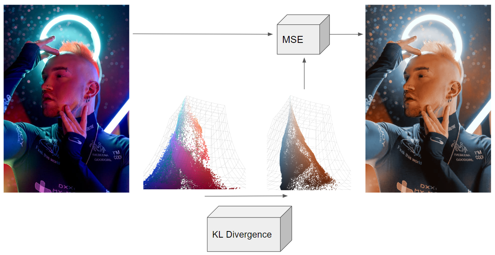

### [Author: John (Jack) Messerly](https://www.linkedin.com/in/jack-messerly-567b9b96/)

   

Welcome to my informal algorithm design portfolio, where I try and present novel techniques to odd problems I find in my day-to-day work. I focus on the problems themselves and handcrafted solutions to them, rather than writing about the basic engineering techniques in an educational way (like in a Towardsdatascience article). However, if you contact me on LinkedIn, I'd be happy to clarify anything you see here.

 

## [Colored Lighting Removal with VAEs](https://messy-bytes.github.io/Advanced-ML-Color-Fixes/)

## [Joint Image Generation with Stable Diffucions (coming soon)]
