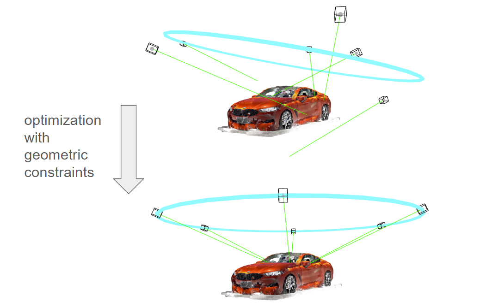

### [Author: John (Jack) Messerly](https://www.linkedin.com/in/jack-messerly-567b9b96/)

 

Welcome to my informal algorithm design portfolio, where I try and present novel techniques to quirky problems I find in my day-to-day work. I focus on the problems themselves and handcrafted solutions to them, rather than writing about basic engineering techniques in an educational way (like in a Towardsdatascience article), or presenting "new research". I don't think anything here is "conference papel novel", but I hope you like it. I try to keep the solutions as practical, on-track and visual as possible.

 
 

## [Colored Lighting Removal with VAEs](https://jp-mess.github.io/Advanced-ML-Color-Fixes/)

An article on how to use a VAE and GIMP to efficiently remove complex lighting effects (that white balance algorithms may struggle with).

 
 

## [Geometric Priors in Ceres](https://jp-mess.github.io/relative-geometry-writeup/)

How to add "geometric prior" constraints to a bundle adjuster in ceres C++, in order to design structure-from-motion around realistic simplifying assumptions.

  

 
 

